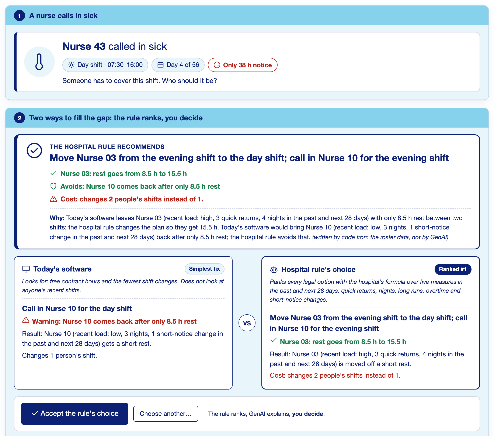
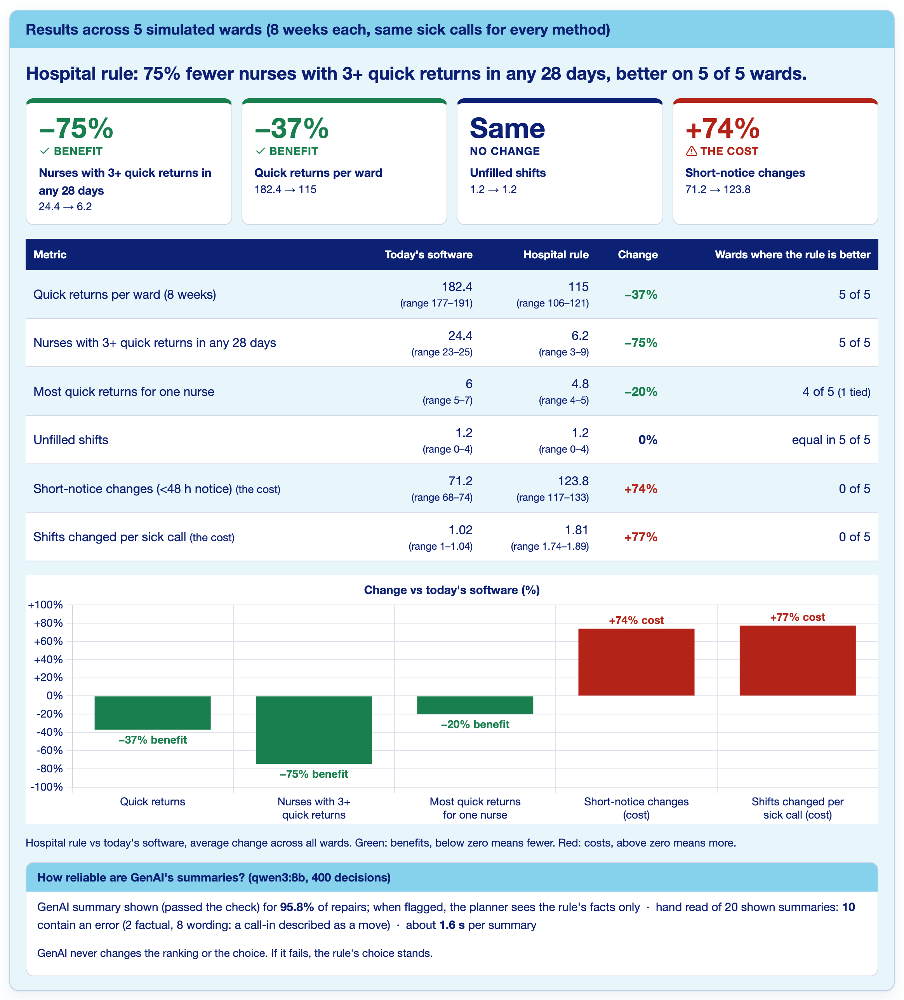
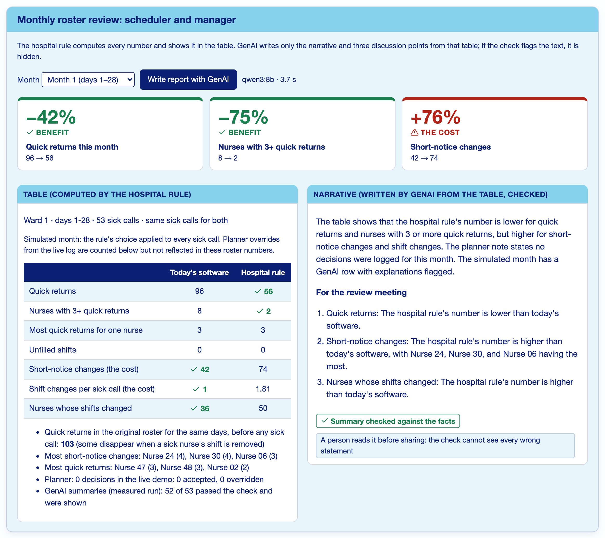
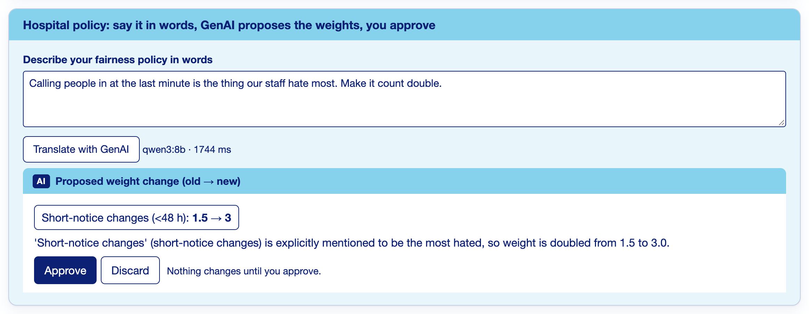

# Roster Repair: strain-aware sick-call repair (prototype)

**What it does.** When a nurse calls in sick, a fixed **hospital rule** ranks every legal way to fill the shift by how much it adds to nurses' recent load (quick returns, nights, long runs, overtime, short-notice changes), and shows its top choice next to the choice of today's software (fewest changes). **GenAI** (a local Qwen3 8B model) only restates the rule's facts in plain words and drafts the monthly scheduler–manager review; every GenAI text is checked against the facts and hidden if it fails. The **planner decides** (accept in one click or choose another with a reason); the **manager approves** any policy change and the monthly report before it is shared.

All data are synthetic (5 wards × 8 weeks, built from Erasmus MC and Dutch parameters). Nurses appear only as codes; no health data.

## How to run

**Requirements.** Python 3.11 or newer (tested on 3.14, macOS) and the packages in `requirements.txt`:
```bash
python3 -m pip install -r requirements.txt
```
**Local model (optional).** Without it the app still runs: the rule decides and its facts are shown, with the message "GenAI unavailable, facts shown".
```bash
brew install ollama          # or download from https://ollama.com
ollama serve                 # keep this running in its own terminal
ollama pull qwen3:8b         # about 5 GB, once
```
The app looks for the model at `http://localhost:11434` (change with the `OLLAMA_URL` environment variable).

**Start the app.**
```bash
cd prototype
python3 -m uvicorn app.server:app --port 8000
```
Open http://localhost:8000.
- **Demo** button, or http://localhost:8000/?demo=1: always opens the same case (ward 1, day 4, Nurse 43 calls in sick) with default weights and the policy box pre-filled with *"Calling people in at the last minute is the thing our staff hate most. Make it count double."* Press **Translate with GenAI**, then **Approve**: the rule's choice changes to *Call in Nurse 31 for the day shift*.
- **Start** begins a ward from the Setup menu. Tabs: 1. One sick call, 2. Results across all wards, 3. Monthly report.
- **?shot=1** (e.g. `/?shot=1&page=results`): screenshot mode with a fixed 1,400 px width, no setup controls and no empty space below the last card. Use a 2× device scale factor in the browser or capture tool for slide-quality images.

## How to reproduce the evaluation
Run from `prototype/`. Every command writes to `prototype/results/`. Commands marked LLM need `ollama serve` and qwen3:8b. LLM runs are resumable: delete or move the output `.jsonl` file first to run from scratch.

| What | Command | Output in `results/` |
|---|---|---|
| 5-ward results (results page) | `python3 -m evaluation.e6_arms arms` then `python3 -m evaluation.e6_arms summary` | `e6_runs.csv`, `e6_summary.md`, `e6_arms_by_ward.csv` |
| 200-ward robustness run | `python3 -m evaluation.e1_ab --seeds 200` | `e1_runs.csv`, `e1_stats.csv`, `e1_nurses.csv` |
| Sensitivity (weights, look-ahead, 3% / 8% absence), 50 wards | `python3 -m evaluation.e2_sensitivity --seeds 50` | `e2_runs.csv`, `e2_stats.csv` |
| E8: rule writes facts, GenAI writes wording (LLM) | `python3 -m evaluation.e8_factblock gate`, `... explain`, `... summary` | `e8_factblock_qwen3-8b.jsonl`, `e8_factblock_summary.md` |
| E9: accounting, stricter check, small fixes | `python3 -m evaluation.e9_followup accounting`, `... rescore`, `... score-load`, `... small` (needs the git history) | `e9_*.md`, `e9_accounting_labels.csv`, `e9_rescored_v3.jsonl` |
| Template comparison (no GenAI) | `python3 -m evaluation.e9_followup template` | `e9_template.jsonl`, `e9_item4_template.md` |
| E10: final design, GenAI restates facts only (LLM) | `python3 -m evaluation.e10_restate explain`, `... score`, `... monthly` | `e10_restate_qwen3-8b.jsonl`, `e10_restate_scored.jsonl`, `e10_summary.md`, `e10_monthly_table.jsonl`, `e10_monthly_summary.md` |

Hand reads are recorded in `e8_manual_reads.md`, `e9_summary.md` and `e10_summary.md` (and `e10_hand_read.json`). Figures: `python3 -m evaluation.make_figures` (writes `figures/`).

## Tests
```bash
cd prototype && python3 -m pytest -q        # 202 tests, about 30 s, no model needed
```

## Main results (5 synthetic wards, 8 weeks each, same sick calls for both)

| Measure | Today's software | Hospital rule | Change | Wards where the rule is better |
|---|---|---|---|---|
| Quick returns per ward | 182.4 | 115.0 | −37% | 5 of 5 |
| Nurses with 3+ quick returns in any 28 days | 24.4 | 6.2 | −75% | 5 of 5 |
| Most quick returns for one nurse | 6.0 | 4.8 | −20% | 4 of 5 (1 tied) |
| Unfilled shifts | 1.2 | 1.2 | 0% | equal in 5 of 5 |
| Short-notice changes, less than 48 h notice (cost) | 71.2 | 123.8 | +74% | 0 of 5 |
| Shifts changed per sick call (cost) | 1.02 | 1.81 | +77% | 0 of 5 |

In the 200-ward run the rule cut nurses with 3+ quick returns from 23.2 to 6.7 (−71%), better in all 200 wards, with unfilled shifts unchanged.

**GenAI summary reliability (final design, 400 decisions, qwen3:8b).** The summary passed the check and was shown for **95.8%** of repairs (otherwise the planner sees the rule's facts only), at about 1.6 s each. A hand read of 20 randomly chosen shown summaries found **10 of 20 with an error: 2 factual, 8 wording** (a call-in described as a move). A fixed template written from the rule's facts passed every check in 400 of 400. Monthly reports: the check passed 10 of 10, but a hand read found 5 of 10 fully correct, so a person approves each report.

## Limitations
- **Synthetic data**: wards, rosters and sick calls are simulated, not Erasmus MC records.
- **Reconstructed baseline**: "today's software" is rebuilt from vendor material (fewest changes, then contract fit), not ORTEC's real configuration.
- **Planner assumed to accept**: the batch results apply the rule's top choice every time; real overrides are untested.
- **Check tuned on its own cases**: the fact check was refined on the 61 hand-labelled cases it was later scored against; only the 20-summary hand read is an independent test.
- **Monthly draft needs human approval**: the check cannot see every wrong statement in GenAI's words.
- E8 to E10 outputs on file were produced before the fact label was renamed from "last-minute call-ins" to "short-notice changes"; rerunning them uses the new label, so GenAI's wording can differ.
- Five wards show direction, not statistical significance.

## Screenshots (`docs/exhibits/`)
| | |
|---|---|
|  |  |
| Planner screen: the recommendation, both choices, accept | Results across 5 wards |
|  |  |
| Monthly review: rule's table, GenAI narrative | Policy in words, GenAI proposes, manager approves |

Also: `planner_screen_full.png`, `planner_sections_1_2.png`, `policy_before_with_choice.png`, `policy_after_with_choice.png`, `policy_panel_after.png`.
